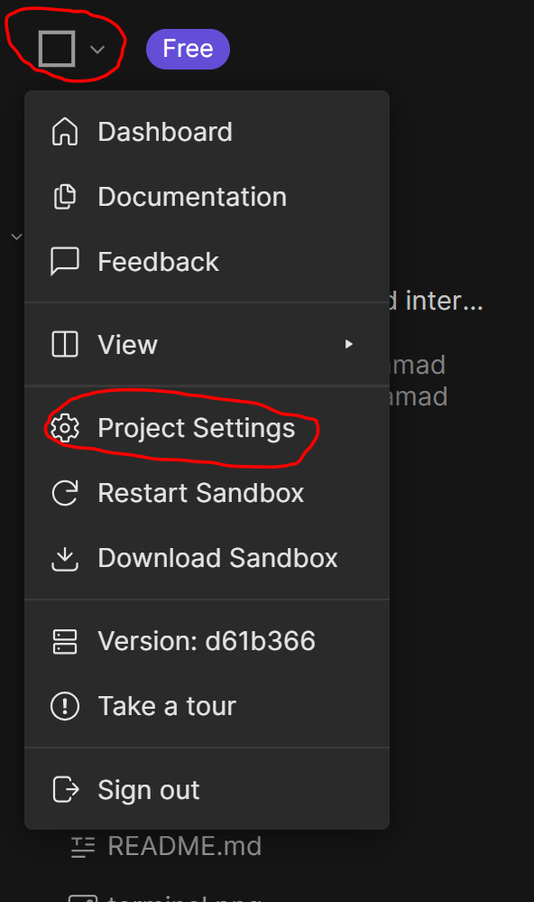
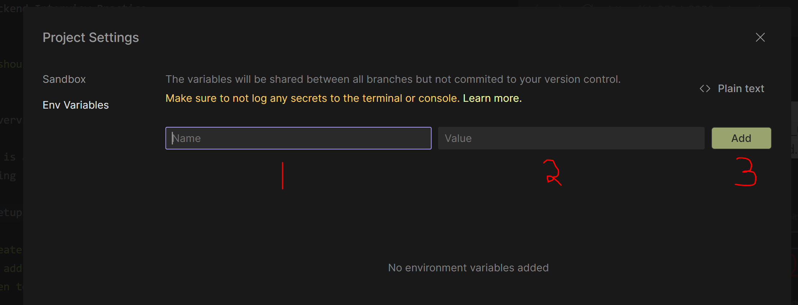

# Backend Interview Practice

```
You should only need to edit files in the `todo` folder
```

## Overview

This is a partial application that the student will complete to get all the tests passing

## Setup

- Create a new database instance in [elephant sql](https://www.elephantsql.com/)
- To add your database info to the app, click the square at the top let of the screen to open the menu and select `Project Settings`. 


- Configure the environmental variables. `DB_URL` will go into the name field and your `elephant sql url` will go in the value field.  
  
- Click the `Add` button then the `Restart instance` at the bottom of the modal.
- Open a new terminal and run the command `npm run migrate` to create the database tables. If prompted for a password, just press enter.
- run the command `npm t`
- You should see output from 10 integration tests, some will be failing.

### Note:

- The service code is all set up. No changes are needed.
- Remember to log values.
- The tests expect the data to be returned as arrays or simple object, not in an object with a data property like the curriculum shows.

```
res.json([]) 👍 ✔
```

```
res.json({data: []}) 👎 ❌
```

## Exercise

1. Add the GET (all) endpoint.
2. Add the GET (id) endpoint.
3. Add the POST endpoint.

You have completed the task when all the unit tests pass.
